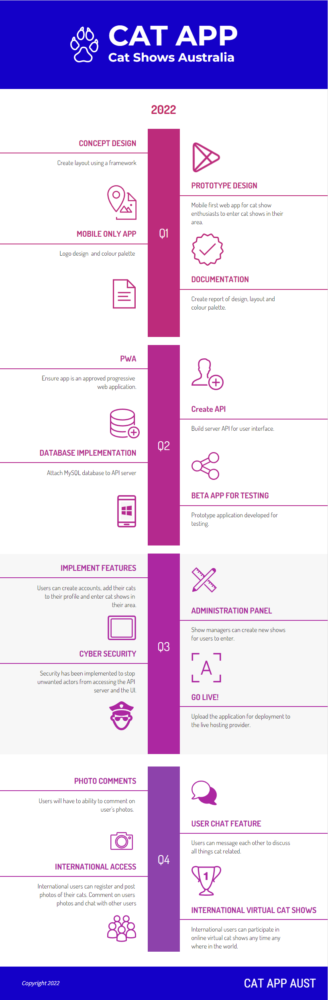

<div id="top"></div>

[![LinkedIn][linkedin-shield]][linkedin-url]

<!-- PROJECT LOGO -->
<br />
<div align="center">
  <a href="https://github.com/mdtdallas/PROJ4">
    
  </a>

<h3 align="center">Cat Shows</h3>

  <p align="center">
    Cat Shows is for all you cat enthusiasts out there to compete in cat shows in your area. Connect with community and celebrate your joy of cats 
    <br />
    <br />
    <br />
    <br />
    <a href="https://github.com/mdtdallas/PROJ4"><strong>Explore the docs »</strong></a>
    <br />
    <br />
    <a href="https://github.com/mdtdallas/PROJ4">View Demo</a>
    ·
    <a href="https://github.com/mdtdallas/PROJ4/issues">Report Bug</a>
    ·
    <a href="https://github.com/mdtdallas/PROJ4/issues">Request Feature</a>
  </p>
</div>

<!-- TABLE OF CONTENTS -->
<details>
  <summary>Table of Contents</summary>
  <ol>
    <li>
      <a href="#about-the-project">About The Project</a>
      <ul>
        <li><a href="#built-with">Built With</a></li>
      </ul>
    </li>
    <li>
      <a href="#getting-started">Getting Started</a>
      <ul>
        <li><a href="#prerequisites">Prerequisites</a></li>
        <li><a href="#installation">Installation</a></li>
      </ul>
    </li>
    <li><a href="#usage">Usage</a></li>
    <li><a href="#roadmap">Roadmap</a></li>
    <li><a href="#contributing">Contributing</a></li>
    <li><a href="#license">License</a></li>
    <li><a href="#contact">Contact</a></li>
    <li><a href="#acknowledgments">Acknowledgments</a></li>
  </ol>
</details>

<!-- ABOUT THE PROJECT -->

## About The Project

<!-- [![Product Name Screen Shot][product-screenshot]](https://example.com) -->

<p align="right">(<a href="#top">back to top</a>)</p>

### Built With

- [express.js](https://expressjs.com/)
- [node.js](https://nodejs.org/en/)
- [react.js](https://reactjs.org/en/)

Packages used in this application include...

<details>
  <summary>NPM Packages</summary>
  <ul>
    <li>
      <a href="https://nodejs.org/en/download/">Server</a>
      <ul>
        <li><a href="https://nodejs.org/en/download/">Node JS</a></li>
        <li><a href="https://expressjs.com/">Express JS</a></li>
        <li><a href="https://reactjs.org/en/">React JS</a></li>
      </ul>
    </li>
    <li>
      <a href="#">NPM Packages</a>
      <ul>
        <li>
          <a href="#">Server</a>
          <ul>
            <li>
              <a href="#">BCrypt Version 5.0.1</a>
              <p>This package is used to encrypt users and admin passwords. Used in the login route</p>
            </li>
            <li>
              <a href="#">CORS Version 2.8.5</a>
              <p>This package is used to ensure that only valid requests from specific domains are accepted. Used in the server.js</p>
            </li>
            <li>
              <a href="#">DOTENV  Version 16.0.1</a>
              <p>This package is used to store sensitive variables and keys</p>
            </li>
            <li>
             <a href="#">express Version 4.17.3</a>
              <p>This package is used as the framework of the server</p>
            </li>
            <li>
              <a href="#">rate limiter Version 6.3.0</a>
              <p>This package is used to limit the rate of requests to aviod DDOS attacks. Used in server.js</p>
            </li>
            <li>
              <a href="#">session Version 6.17.2</a>
              <p>This package is used to limit the rate of requests to aviod DDOS attacks. Used in server.js</p>
            </li>
            <li>
              <a href="#">express slow down Version 1.4.0</a>
              <p>This package is used to slow down the rate of requests to the server. Used in server.js</p>
            </li>
            <li>
              <a href="#">jason web token Version 8.5.1</a>
              <p>This package is used for verification and authorization from the client to the serve. Used in the login route and for verification in Auth.js</p>
            </li>
            <li>
              <a href="#">MySQL Version 2.3.3</a>
              <p>This package is used to store data to a SQL database. Used in db.js</p>
            </li>
            <li>
              <a href="#">validator Version 13.7.0</a>
              <p>This package is used to validate data from client before it is entered in to the database. Used in the routes to aviod unwanted code entering the database.</p>
            </li>
          </ul>
        </li>
         <a href="#">Client</a>
            <ul>
              <li>
                <a href="#">Material UI Version 5</a>
                <p>This package is used for sytling the elements in the User Interface. Used in the User Interface</p>
              </li>
              <li>
              <a href="#">Bootstrap Version 5.1.3</a>
                <p>This package is used for sytling the elements in the User Interface. Used in the User Interface</p>
              </li>
              <li>
              <a href="#">Formik Version 2.2.9</a>
                <p>This package is used to submit form data from the client to the server. Used for forms in the user interface</p>
              </li>
              <li>
              <a href="#">React Version 18</a>
              <p>This package is used as the framework of the client</p>
              </li>
              <li>
                <a href="#">React Dom Version 18</a>
                <p>This package is used to access the virtual dom in react applications</p>
              </li>
              <li>
              <a href="#">React Router Dom Version 6.3.0</a>
              <p>This package is used navigate users around the site via links</p>
              </li>
              <li>
              <a href="#">Reactstrap Version 9.0.2</a>
              <p>This package is used to style elements in the User Interface. Used in the User Interface</p>
              </li>
              <li>
              <a href="#">Yup Version 0.32.11</a>
              <p>This package is used validate form data from the client before it is sent to the server. Used to validate form data before sending to client.</p>
              </li>
            </ul>
        <li>
          <a href="#">Admin</a>
          <ul>
            <li>
              <a href="#">Material UI Version 5</a>
              <p>This package is used for sytling the elements in the User Interface. Used in the User Interface</p>
            </li>
            <li>
              <a href="#">Formik Version 2.2.9</a>
              <p>This package is used to submit form data from the client to the server. Used for forms in the user interface</p>
            </li>
            <li>
              <a href="#">React Version 18</a>
              <p>This package is used as the framework of the client</p>
            </li>
            <li>
              <a href="#">React Dom Version 18</a>
              <p>This package is used to access the virtual dom in react applications</p>
            </li>
            <li>
              <a href="#">React Router Dom Version 6.3.0</a>
              <p>This package is used navigate users around the site via links</p>
            </li>
            <li>
              <a href="#">Yup Version 0.32.11</a>
               <p>This package is used validate form data from the client before it is sent to the server. Used to validate form data before sending to client.</p>
            </li>
          </ul>
        </li>
      </ul>
    </li>
  </ul>
</details>

<p align="right">(<a href="#top">back to top</a>)</p>

<!-- GETTING STARTED -->

## Getting Started

To get a local copy up and running follow these simple steps.

### Prerequisites

This is a list things you need to use the software and how to install them.

Nodejs

```sh
download nodejs from https://nodejs.org/en/download/ and install
```

XAMPP

```sh
 download XAMPP from https://www.apachefriends.org/download.html and install
```

### Installation

1. Clone the repo
   ```sh
   git clone https://github.com/mdtdallas/PROJ4.git
   ```
2. Install NPM packages

- npm

  ```sh
  Navigate to server folder in terminal
  npm install npm@latest -g
  ```

- npm

  ```sh
  Navigate to client folder in terminal
  npm install npm@latest -g
  ```

- npm
  ```sh
  Navigate to admin folder in terminal
  npm install npm@latest -g
  ```

3. Create database locally
- phpmyadmin / workbench
   ```sh
   Open http://localhost/phpmyadmin in browser
   Add new database
   select database and click import
   select to proj4/api_db and click GO
   check for errors
   ```

4. Update db.js

 ```sh
 Open proj4/server/db.js and edit the Host, Username, Password and Database for you local server.
````

5. Run

- npm

  ```sh
  Navigate to server folder in terminal
  npm run devStart
  ```

- npm

  ```sh
  Navigate to client folder in terminal
  npm run start
  ```

- npm
  ```sh
  Navigate to admin folder in terminal
  npm run start
  ```

<p align="right">(<a href="#top">back to top</a>)</p>

<!-- USAGE -->

## Usage

This is the full stack Node, React, MySQL Cat Shows App. Please stay tuned for updates
This application is free and open source for everyone.

<p align="right">(<a href="#top">back to top</a>)</p>

<!-- ROADMAP -->

## Roadmap



- [ ] Comments on cat photos
- [ ] User Chat feature
- [ ] International Access
- [ ] Virtual Cat show across the world!

See the [open issues](https://github.com/mdtdallas/PROJ4/issues) for a full list of proposed features (and known issues).

<p align="right">(<a href="#top">back to top</a>)</p>

<!-- CONTRIBUTING -->

## Contributing

Contributions are what make the open source community such an amazing place to learn, inspire, and create. Any contributions you make are **greatly appreciated**.

If you have a suggestion that would make this better, please fork the repo and create a pull request. You can also simply open an issue with the tag "enhancement".
Don't forget to give the project a star! Thanks again!

1. Fork the Project
2. Create your Feature Branch (`git checkout -b feature/AmazingFeature`)
3. Commit your Changes (`git commit -m 'Add some AmazingFeature'`)
4. Push to the Branch (`git push origin feature/AmazingFeature`)
5. Open a Pull Request

<p align="right">(<a href="#top">back to top</a>)</p>

<!-- LICENSE -->

## License

Distributed under the MIT License. See `LICENSE.txt` for more information.

<p align="right">(<a href="#top">back to top</a>)</p>

<!-- CONTACT -->

## Contact

Dallas Little - [@mdtdallas](https://twitter.com/mdtdallas) - admin@dallaslittle.xyz

Project Link: [https://github.com/mdtdallas/PROJ4](https://github.com/mdtdallas/PROJ4)

<p align="right">(<a href="#top">back to top</a>)</p>

<!-- ACKNOWLEDGMENTS -->

## Acknowledgments

- [Dallas Little]()
- [Jack Cooke]()

<p align="right">(<a href="#top">back to top</a>)</p>

<!-- MARKDOWN LINKS & IMAGES -->
<!-- https://www.markdownguide.org/basic-syntax/#reference-style-links -->

[contributors-shield]: https://img.shields.io/github/contributors/mdtdallas/PROJ4.svg?style=for-the-badge
[contributors-url]: https://github.com/mdtdallas/PROJ4/graphs/contributors
[forks-shield]: https://img.shields.io/github/forks/mdtdallas/PROJ4.svg?style=for-the-badge
[forks-url]: https://github.com/mdtdallas/PROJ4/network/members
[stars-shield]: https://img.shields.io/github/stars/mdtdallas/PROJ4.svg?style=for-the-badge
[stars-url]: https://github.com/mdtdallas/PROJ4/stargazers
[issues-shield]: https://img.shields.io/github/issues/mdtdallas/PROJ4.svg?style=for-the-badge
[issues-url]: https://github.com/mdtdallas/PROJ4/issues
[license-shield]: https://img.shields.io/github/license/mdtdallas/PROJ4.svg?style=for-the-badge
[license-url]: https://github.com/mdtdallas/PROJ4/blob/master/LICENSE.txt
[linkedin-shield]: https://img.shields.io/badge/-LinkedIn-black.svg?style=for-the-badge&logo=linkedin&colorB=555
[linkedin-url]: https://linkedin.com/in/dallaslittle
[product-screenshot]: images/screenshot.png
