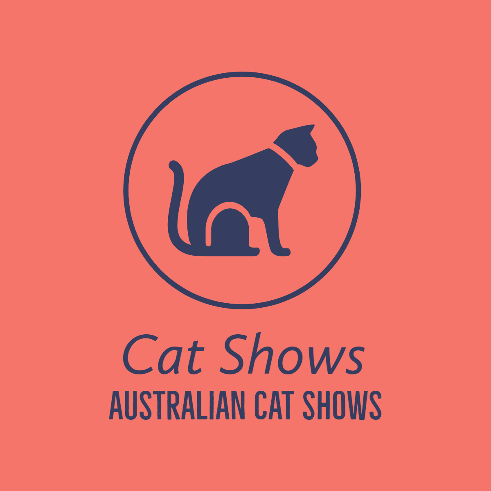

<div id="top"></div>
<!--
*** Thanks for checking out the Best-README-Template. If you have a suggestion
*** that would make this better, please fork the repo and create a pull request
*** or simply open an issue with the tag "enhancement".
*** Don't forget to give the project a star!
*** Thanks again! Now go create something AMAZING! :D
-->


<!-- PROJECT SHIELDS -->
<!--
*** I'm using markdown "reference style" links for readability.
*** Reference links are enclosed in brackets [ ] instead of parentheses ( ).
*** See the bottom of this document for the declaration of the reference variables
*** for contributors-url, forks-url, etc. This is an optional, concise syntax you may use.
*** https://www.markdownguide.org/basic-syntax/#reference-style-links
-->
[![LinkedIn][linkedin-shield]][linkedin-url]


<!-- PROJECT LOGO -->
<br />
<div align="center">
  <a href="https://github.com/mdtdallas/catshows">
    
  </a>

<h3 align="center">Cat Shows</h3>

  <p align="center">
    Cat Shows is for all you cat enthusiasts out there to compete in cat shows in your area. Connect with community and celebrate your joy of cats 
    <br />
    <br />
    <br />
    <br />
    <a href="https://github.com/mdtdallas/catshows"><strong>Explore the docs »</strong></a>
    <br />
    <br />
    <a href="https://github.com/mdtdallas/catshows">View Demo</a>
    ·
    <a href="https://github.com/mdtdallas/catshows/issues">Report Bug</a>
    ·
    <a href="https://github.com/mdtdallas/catshows/issues">Request Feature</a>
  </p>
</div>


<!-- TABLE OF CONTENTS -->
<details>
  <summary>Table of Contents</summary>
  <ol>
    <li>
      <a href="#about-the-project">About The Project</a>
      <ul>
        <li><a href="#built-with">Built With</a></li>
      </ul>
    </li>
    <li>
      <a href="#getting-started">Getting Started</a>
      <ul>
        <li><a href="#prerequisites">Prerequisites</a></li>
        <li><a href="#installation">Installation</a></li>
      </ul>
    </li>
    <li><a href="#usage">Usage</a></li>
    <li><a href="#roadmap">Roadmap</a></li>
    <li><a href="#contributing">Contributing</a></li>
    <li><a href="#license">License</a></li>
    <li><a href="#contact">Contact</a></li>
    <li><a href="#acknowledgments">Acknowledgments</a></li>
  </ol>
</details>


<!-- ABOUT THE PROJECT -->
## About The Project

<!-- [![Product Name Screen Shot][product-screenshot]](https://example.com) -->


<p align="right">(<a href="#top">back to top</a>)</p>


### Built With

* [express.js]( https://expressjs.com/)
* [node.js]( https://nodejs.org/en/)

Coming Soon with the Front End

* * [Next.js](https://nextjs.org/)

<p align="right">(<a href="#top">back to top</a>)</p>


<!-- GETTING STARTED -->
## Getting Started

This is an example of how you may give instructions on setting up your project locally.
To get a local copy up and running follow these simple example steps.

### Prerequisites

This is an example of how to list things you need to use the software and how to install them.
* npm
  ```sh
  npm install npm@latest -g
  ```

### Installation

1. Clone the repo
   ```sh
   git clone https://github.com/mdtdallas/catshows.git
   ```
2. Install NPM packages
   ```sh
   npm install
   ```
3. Run server.js
   ```sh
   npm start
   ```

<p align="right">(<a href="#top">back to top</a>)</p>


<!-- USAGE EXAMPLES -->
## Usage

This is only the back end server for the up and coming Cat Shows App. Please stay tuned for updates

_For more examples, please refer to the [Documentation](https://example.com)_

<p align="right">(<a href="#top">back to top</a>)</p>


<!-- ROADMAP -->
## Roadmap

- [ ] Back end server
- [ ] Beautiful Front end graphical interface
- [ ] Fully operational Progressive Web Application [PWA]

See the [open issues](https://github.com/mdtdallas/catshows/issues) for a full list of proposed features (and known issues).

<p align="right">(<a href="#top">back to top</a>)</p>


<!-- CONTRIBUTING -->
## Contributing

Contributions are what make the open source community such an amazing place to learn, inspire, and create. Any contributions you make are **greatly appreciated**.

If you have a suggestion that would make this better, please fork the repo and create a pull request. You can also simply open an issue with the tag "enhancement".
Don't forget to give the project a star! Thanks again!

1. Fork the Project
2. Create your Feature Branch (`git checkout -b feature/AmazingFeature`)
3. Commit your Changes (`git commit -m 'Add some AmazingFeature'`)
4. Push to the Branch (`git push origin feature/AmazingFeature`)
5. Open a Pull Request

<p align="right">(<a href="#top">back to top</a>)</p>


<!-- LICENSE -->
## License

Distributed under the MIT License. See `LICENSE.txt` for more information.

<p align="right">(<a href="#top">back to top</a>)</p>


<!-- CONTACT -->
## Contact

Your Name - [@mdtdallas](https://twitter.com/mdtdallas) - admin@dallaslittle.xyz

Project Link: [https://github.com/mdtdallas/catshows](https://github.com/mdtdallas/catshows)

<p align="right">(<a href="#top">back to top</a>)</p>


<!-- ACKNOWLEDGMENTS -->
## Acknowledgments

* [Dallas Little]()
* [Phil Hope]()
* [Meg Little]()

<p align="right">(<a href="#top">back to top</a>)</p>


<!-- MARKDOWN LINKS & IMAGES -->
<!-- https://www.markdownguide.org/basic-syntax/#reference-style-links -->
[contributors-shield]: https://img.shields.io/github/contributors/mdtdallas/catshows.svg?style=for-the-badge
[contributors-url]: https://github.com/mdtdallas/catshows/graphs/contributors
[forks-shield]: https://img.shields.io/github/forks/mdtdallas/catshows.svg?style=for-the-badge
[forks-url]: https://github.com/mdtdallas/catshows/network/members
[stars-shield]: https://img.shields.io/github/stars/mdtdallas/catshows.svg?style=for-the-badge
[stars-url]: https://github.com/mdtdallas/catshows/stargazers
[issues-shield]: https://img.shields.io/github/issues/mdtdallas/catshows.svg?style=for-the-badge
[issues-url]: https://github.com/mdtdallas/catshows/issues
[license-shield]: https://img.shields.io/github/license/mdtdallas/catshows.svg?style=for-the-badge
[license-url]: https://github.com/mdtdallas/catshows/blob/master/LICENSE.txt
[linkedin-shield]: https://img.shields.io/badge/-LinkedIn-black.svg?style=for-the-badge&logo=linkedin&colorB=555
[linkedin-url]: https://linkedin.com/in/dallaslittle
[product-screenshot]: images/screenshot.png
